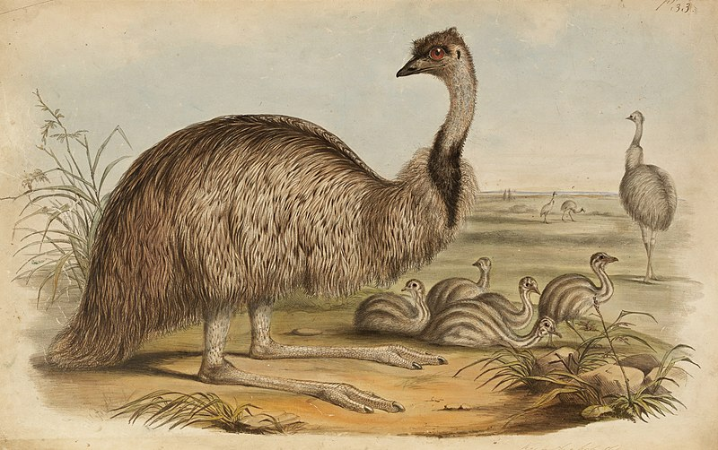

# Eitan's Marginally Useful GPT

I want to create a terminal application to interact with an LLM.

- I want to use [textualize/textual](https://github.com/textualize/textual/)
- I want to use [langchain-ai/langchain](https://github.com/langchain-ai/langchain)

This project is very similar to [darrenburns/elia](https://github.com/darrenburns/elia) but written by me instead.

Lets go!
